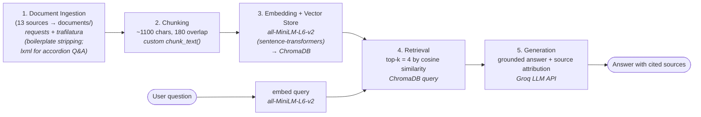
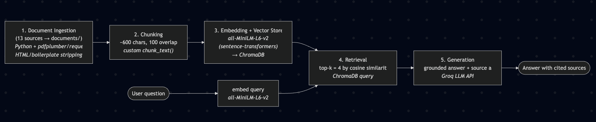

# Project 1 Planning: The Unofficial Guide

> Write this document before you write any pipeline code.
> Your spec and architecture diagram are what you'll use to direct AI tools (Claude, Copilot, etc.) to generate your implementation — the more specific they are, the more useful the generated code will be.
> Update the Retrieval Approach and Chunking Strategy sections if you change your approach during implementation.
> Update this file before starting any stretch features.

---

## Domain

<!-- What domain did you choose? Why is this knowledge valuable and hard to find through official channels? -->

**Domain: Eating well as an Iowa State University student** — navigating campus dining (meal plans, dining centers, dietary accommodations), eating healthy in a cafeteria setting, and grocery shopping in Ames.

I chose this domain because the practical answer to "how do I actually eat well here?" lives in three places that no single official source connects:

1. **Official ISU Dining pages** tell you *what exists* — plan prices, what a Flex Meal is, that a Special Diet Kitchen exists — but they're written to sell plans and list policies, not to advise. They won't tell you which dining center students actually like or whether a plan is worth it.
2. **Student and journalism sources** (Iowa State Daily) capture *lived experience* — which stations are good, which foods are favorites — but they're scattered across years of articles and aren't searchable as one knowledge base.
3. **Dietitian and health-education guides** (Dr. Rachel Paul, SNHU, ISU Student Health) give the *how-to* technique — the plate method, salad-bar formulas — but they're generic or buried on a wellness page a student would never think to search.

A new or budget-conscious student asking "how do I eat healthy on my meal plan without overspending?" has to manually stitch all three together. This knowledge is valuable precisely because it's fragmented and partly informal — official channels won't editorialize, and student opinion isn't indexed anywhere. A RAG system that retrieves across all three perspectives at once is genuinely more useful than any one source.

---

## Documents

<!-- List your specific sources: URLs, subreddit names, forum threads, or file descriptions.
     Aim for at least 10 sources that together cover different subtopics or perspectives within your domain. -->

| # | Source | Description | URL or location |
|---|--------|-------------|-----------------|
| 1 | ISU Dining — Meal Plans & Rates | Official plan names, prices, what each includes, and which halls require a plan | https://www.dining.iastate.edu/meal-plans/ |
| 2 | ISU Dining — Sustainability | Green dining practices: composting, 10% local purchasing, reusable-cup discount, food-waste reduction | https://www.dining.iastate.edu/sustainability/  |
| 3 | ISU Dining — Meal Plan FAQs | Q&A on what's included, where plans work, balances, to-go/order-ahead, sick meals | https://www.dining.iastate.edu/meal-plans/faqs/  |
| 4 | ISU Dining — Nutrition | NetNutrition, ingredient/allergen labels, QR codes, registered-dietitian "Let's Talk" | https://www.dining.iastate.edu/nutrition/  |
| 5 | ISU Dining — Accommodations / Special Diet Kitchen | Special Diet Kitchen, top-9 allergen / gluten-free / dairy-free / vegan / halal options, how to request | https://www.dining.iastate.edu/nutrition/accommodations/ |
| 6 | ISU Dining — Union Drive Marketplace | A dining-center page: payment types accepted, menu filters, allergen disclaimer | https://www.dining.iastate.edu/location/union-drive-marketplace-2-2/  |
| 7 | ISU Student Health & Wellness — Nutrition & Body Image (Joyful Eating) | Non-diet / Health at Every Size approach, campus dietitian, meal-planning & grocery budgeting, eating-disorder support, how to book | https://cyclonehealth.iastate.edu/nutrition-body-image  |
| 8 | Iowa State Daily — ISU students share favorite campus dining spots | Student quotes on best dining halls/foods (UDM tacos, Fuse bowls, Friley Windows, Seasons) and meal-plan convenience | https://iowastatedaily.com/320101/news-student-life/isu-students-share-favorite-campus-dining-spots/  |
| 9 | Iowa State Daily — Dietitian on campus works to help boost healthy eating | Reporting on special-diet support and the push for a campus dietitian; staff quotes on healthy eating | https://iowastatedaily.com/127879/news/dietitian-on-campus-works-to-help-boost-healthy-eating/  |
| 10 | Iowa State Daily — Know your grocery shopping options in Ames | Guide to Aldi, Hy-Vee, Fareway, Wheatsfield co-op, Dahl's — prices, locations, what each is good for | https://iowastatedaily.com/149775/special-sections/know-your-grocery-shopping-options-in-ames/ |
| 11 | Iowa State Daily — Campus dining for all ISU students | Overview of every dining center (Conversations, Seasons, Knapp-Storms, UDCC) and their food stations | https://iowastatedaily.com/135432/special-sections/campus-dining-for-all-isu-students/ |
| 12 | Dr. Rachel Paul — Eating Healthy in a College Cafeteria | Concrete dining-hall technique: plate method, salad-bar formula, station-by-station (grill, soups, pizza, breakfast) | https://www.drrachelpaul.com/blog/eating-healthy-in-a-college-cafeteria/|
| 13 | SNHU — How to Eat Healthy in College: 15 Tips to Avoid the "Freshman 15" | Campus-dietitian's 15 tips: power nutrients, portions, hydration, not skipping meals, sleep, stress, using campus resources | https://www.snhu.edu/about-us/newsroom/health/how-to-eat-healthy-in-college-and-avoid-freshman-15  |

---

## Chunking Strategy

<!-- How will you split documents into chunks?
     State your chunk size (in tokens or characters), overlap size, and explain why those
     numbers fit the structure of your documents.
     A review-heavy corpus warrants different chunking than a long FAQ. -->

**Chunk size:** ~1100 characters (≈275 tokens) — *revised up from 600 after Milestone-4 retrieval testing (see below)*

**Overlap:** 180 characters (≈16%)

**Reasoning:**

My corpus is **prose-heavy, not review-heavy** — it's FAQ Q&A pairs, news articles, official dining policy pages, and how-to guides. There are almost no 1–3 sentence reviews, so the tiny (~200-char) chunks you'd use for an opinion-review corpus would be wrong here: they'd slice a single FAQ answer or a dietitian's salad-bar formula into fragments that mean nothing on their own.

I **started at 600 characters** (≈ one FAQ answer or one guide paragraph), reasoning that smaller chunks keep retrieval precise. That worked well for the self-contained FAQ Q&A queries (Q2, Q4) but **failed exactly where I'd predicted in Anticipated Challenges #1**: when I tested retrieval against my 5 eval queries, Dr. Rachel Paul's salad-bar formula (Q1) was split across two adjacent chunks — "2 cups greens" in one, the protein/fat amounts in the next — so neither chunk alone answered the question, and the conversational student-favorites reviews (Q5) were fragmented away from their framing, leaving their source out of the top-4.

I ran a chunk-size sweep (600 / 800 / 900 / 1000 / 1100 / 1200) and measured, per eval query, the best distance and whether the expected source landed in the top-4. **1100 characters was the sweet spot:** all five queries put their expected source in the top-4 with every #1-result distance < 0.5, the salad-bar formula now sits intact in a single chunk, and the corpus stays at 52 chunks (above the 50-chunk floor). Going larger (1200) pushed Q1's best distance over 0.5 and dropped below 50 chunks; going smaller left Q3/Q5 sources outside the top-4.

The 180-character overlap (~16%, same ratio as before) keeps a fact that lands near a chunk edge intact in at least one chunk, so a meal-plan name and its price aren't split where neither half is findable.

**How I'll know if I got it wrong:**
- *Too small:* answers come back missing context — the system retrieves "the price is $X" but not which plan it belongs to, because the plan name was chunked separately.
- *Too large:* retrieval returns chunks that are "about the right topic" but mostly filler, and the LLM's answer drifts or cites the wrong detail because the relevant sentence is buried among 4 unrelated ones.

**Preprocessing before chunking:** strip HTML/boilerplate (nav menus, footers, cookie banners) and collapse whitespace, so chunks contain real content rather than page chrome.

---

## Retrieval Approach

<!-- Which embedding model are you using (e.g., all-MiniLM-L6-v2 via sentence-transformers)?
     How many chunks will you retrieve per query (top-k)?
     If you were deploying this for real users and cost wasn't a constraint, what tradeoffs
     would you weigh in choosing a different embedding model — context length, multilingual
     support, accuracy on domain-specific text, latency? -->

**Embedding model:** `all-MiniLM-L6-v2` via `sentence-transformers` (384-dim, runs locally, no API cost).
**Top-k:** 4 chunks per query.
I chose `all-MiniLM-L6-v2` because it's fast, runs entirely on-device (no key, no per-query cost), and is the standard well-benchmarked baseline for semantic search on general English prose — which is exactly what my corpus is. Semantic embeddings let the system match a query like *"is the meal plan worth the money?"* to a chunk that says *"students said the convenience justified the cost"* even though they share almost no exact words, because both map to nearby points in embedding space. That's the whole reason I'm using embeddings instead of keyword search.

I picked **top-k = 4** because a good answer here often needs to combine perspectives — e.g., an official fact *plus* a student opinion *plus* a dietitian tip. Too few (k=1–2) and multi-part questions lose context; too many (k=8+) and the prompt fills with marginally-relevant chunks that dilute the answer and can pull the LLM off-topic. 4 gives room to synthesize across sources without much noise.

**Production tradeoff reflection :**
- **Accuracy on domain text:** MiniLM is general-purpose. A larger model (e.g., OpenAI `text-embedding-3-large` or `bge-large`) would better distinguish near-synonyms that matter here — "Flex Meal" vs "Dining Dollars" vs "meal swipe" are distinct concepts a small model might blur.
- **Context length:** MiniLM truncates at 256 tokens, which is fine given my 150-token chunks, but a longer-context model would let me use bigger chunks without losing the tail.
- **Multilingual:** not a priority for an English ISU corpus, so I wouldn't pay for a multilingual model here.
- **Latency & hosting:** MiniLM is local and instant; an API-hosted model adds network latency and a per-query bill. For a real deployment serving many students, I'd weigh whether the accuracy gain justifies ongoing API cost and the new external dependency — for a study/demo project, local MiniLM clearly wins.

---

## Evaluation Plan

<!-- List your 5 test questions with their expected correct answers.
     Questions should be specific enough that you can judge whether the system's response
     is right or wrong. "What are good dining halls?" is too vague.
     "What do students say about wait times at [dining hall name] during lunch?" is testable. -->

| # | Question | Expected answer | Source it should retrieve from |
|---|----------|-----------------|-------------------------------|
| 1 | What salad-bar formula does Dr. Rachel Paul recommend for building a healthy cafeteria salad? | About 2 cups of non-starchy vegetables, one standard protein serving (~120 cal, e.g. chicken breast or canned tuna), and 100–200 calories of fats (nuts, cheese, avocado, or bacon). | #12 (Dr. Rachel Paul guide) |
| 2 | What is the difference between Flex Meals and Dining Dollars on an ISU meal plan? | They are distinct currencies: Flex Meals are a set number of meal entries/swipes usable in dining-related locations, while Dining Dollars are a declining-balance dollar amount spent like cash at campus dining/retail spots. The answer must state that they are *not* the same and explain that one is counted in meals and the other in dollars. | #2 (Flex Meals & Dining Dollars Explained) |
| 3 | How does an ISU student with a food allergy get accommodated, and what does the Special Diet Kitchen cover? | ISU Dining has a Special Diet Kitchen that prepares options free of the top-9 allergens (and offers gluten-free / dairy-free / vegan / halal options); students request accommodations by contacting ISU Dining / a registered dietitian rather than relying only on the regular serving lines. | #5 (Accommodations / Special Diet Kitchen) |
| 4 | Which Ames grocery store is best for a student on a tight budget, and what is one more upscale or specialty option? | Aldi is named as the lowest-price / budget option; Hy-Vee or Wheatsfield Co-op are cited as larger-selection or specialty/natural-foods options (Fareway and Dahl's are also covered). The answer must distinguish "cheapest" from "specialty/larger selection." | #10 (Grocery shopping options in Ames) |
| 5 | According to ISU students, name two specific dining spots or foods they call favorites on campus. | Any two of the specific student-named favorites from the article — e.g., Union Drive Marketplace (UDM) tacos, Fuse bowls, Friley Windows, or Seasons. A correct answer names *specific* spots/foods, not a generic "the dining halls are good." | #8 (Students share favorite dining spots) |

---

## Anticipated Challenges

<!-- What could go wrong? Name at least two specific risks with reasoning.
     Consider: noisy or inconsistent documents, missing source attribution, off-topic
     retrieval, chunks that split key information across boundaries. -->

1. **Mixed document types break a single chunking strategy.** My corpus spans terse FAQ Q&A, long how-to guides, and news prose. A fixed 600-char chunk that's perfect for a guide paragraph may split a short FAQ answer from its question, or merge two unrelated FAQ items into one chunk. *Mitigation:* preprocess to keep Q&A pairs together where possible, and inspect a sample of chunks after ingestion to confirm they're coherent rather than trusting the size blindly.

2. **Conflicting / inconsistent facts across sources.** Official ISU pages, student articles, and outdated news pieces may disagree — e.g., a 2019 Iowa State Daily article lists dining centers or prices that have since changed. Retrieval might surface a stale chunk and present it as current. *Mitigation:* include the source name (and date if available) in each chunk's metadata and surface it in the answer, so a reader can judge currency rather than the system silently asserting one figure.

3. **Off-topic / overlapping retrieval.** "Eating healthy in a college cafeteria" content (Dr. Rachel Paul, SNHU) is generic and not ISU-specific, so a query about ISU dining halls could pull a generic tip instead of the ISU-specific answer, or vice versa. *Mitigation:* keep top-k modest (4) and surface source attribution so the user sees whether the answer came from an official ISU page or a generic guide.

4. **Missing source attribution → ungroundable answers.** If the LLM blends 4 chunks without citing which fact came from which source, I can't audit whether it hallucinated. *Mitigation:* enforce per-chunk source labels in the prompt context and require the model to attribute claims (handled in Milestone 5's grounded-generation prompt).

---

## Architecture

<!-- Draw a diagram of your pipeline showing the five stages:
     Document Ingestion → Chunking → Embedding + Vector Store → Retrieval → Generation
     Label each stage with the tool or library you're using.
     You can use ASCII art, a Mermaid diagram, or embed a sketch as an image.
     You'll use this diagram as context when prompting AI tools to implement each stage. -->

| Stage | Tool / library |
|-------|----------------|
| Document Ingestion | `requests` (fetch) + `trafilatura` (main-content extraction); `lxml` to recover accordion Q&A |
| Chunking | custom `chunk_text()` — 1100 chars, 180 overlap |
| Embedding | `all-MiniLM-L6-v2` via `sentence-transformers` |
| Vector Store | ChromaDB (cosine similarity) |
| Retrieval | ChromaDB query, top-k = 4 |
| Generation | Groq LLM API (grounded prompt + source attribution) |

---

## AI Tool Plan

<!-- For each part of the pipeline below, describe:
     - Which AI tool you plan to use (Claude, Copilot, ChatGPT, etc.)
     - What you'll give it as input (which sections of this planning.md, which requirements)
     - What you expect it to produce
     - How you'll verify the output matches your spec

     "I'll use AI to help me code" is not a plan.
     "I'll give Claude my Chunking Strategy section and ask it to implement chunk_text()
     with my specified chunk size and overlap" is a plan. -->

**Milestone 3 — Ingestion and chunking:** *(built — see [ingest.py](ingest.py))*

- *Tool:* Claude (in this Claude Code session).
- *Input I gave it:* my **Chunking Strategy** section (600 chars / 100 overlap, the preprocessing notes) plus my **Documents** table.
- *What it produced:* `ingest.py` with `fetch_html()` (browser User-Agent), `clean_text_from_html()` (trafilatura main-content extraction + entity/whitespace cleanup), `load_documents()` (returns clean text + source metadata, writes `documents/clean/*.txt`), and `chunk_text(text, size=600, overlap=100)` (boundary-aware, packs whole paragraphs/Q&A pairs, carries a 100-char overlap, filters empties). Output → `chunks.json`.
- *What I changed / discovered during verification:*
  - trafilatura dropped the ISU FAQ/plan content because it lives in JS-style **accordion** markup → added an `lxml` extractor (`extract_accordions()`) that pairs each `accordion-button` question with its `accordion-body` answer, so Q&A pairs stay intact.
  - Source **#2 redirects to the same FAQ page as #3** (identical content) → added exact-duplicate chunk de-duplication so the duplicates don't waste retrieval slots. *(Consider swapping #2 for a distinct source later.)*
  - No `.pdf` sources after all, so pdfplumber wasn't needed.
- *Verified output:* all 13 sources ingested (SNHU #13 fetched via Googlebot UA, pasted to `documents/manual/snhu.txt`), 0 empty chunks, no HTML artifacts. Initial run produced 86 chunks at 600/100; **chunk size was later revised to 1100/180 during Milestone 4** (see Chunking Strategy), yielding the final **52 chunks** (avg 1024, max 1276) in `chunks.json`.

**Milestone 4 — Embedding and retrieval:** *(built — see [retrieval.py](retrieval.py))*

- *Tool:* Claude.
- *Input I gave it:* my **Retrieval Approach** section (all-MiniLM-L6-v2, ChromaDB, top-k = 4) and the chunk format from Milestone 3.
- *What it produced:* `retrieval.py` with `build_index()` (encodes chunks with `sentence-transformers`, normalized embeddings, into a persistent ChromaDB collection configured for **cosine** distance, with `source_name` / `source` / `chunk_index` metadata) and `retrieve(query, k=4)` (embeds the query, returns the k nearest chunks with source + distance). A `test_retrieval()` runs all 5 eval queries and prints ranked chunks + distances.
- *What I verified / changed:* ran the 5 eval queries as retrieval-only checks. At 600/100, **Q3 (Special Diet Kitchen) and Q5 (student favorites) had their expected source outside the top-4**, and Q1's salad-bar formula was split across two chunks. I ran a chunk-size sweep and **raised chunking to 1100/180** (documented in Chunking Strategy); after rebuilding the index, all five queries return their expected source in the top-4 with every #1-result cosine distance < 0.5 (Q1 0.485, Q2 0.221, Q3 0.242, Q4 0.258, Q5 0.341). Q5 remains the weakest (its conversational reviews retrieve, but the strongest "favorites" quote isn't always the top #8 chunk) — flagged for the README failure analysis.

**Milestone 5 — Generation and interface:** *(built — see [generation.py](generation.py) and [app.py](app.py))*

- *Tool:* Claude for the generation/prompt code; Groq SDK for the API call.
- *Input I gave it:* my **Anticipated Challenges** section (especially the source-attribution and stale-fact risks) and the requirement that answers be grounded in retrieved chunks only.
- *What it produced:* `generation.py` with `generate_answer(query, chunks)` (builds a numbered, source-labeled context block and calls Groq `llama-3.3-70b-versatile` at temperature 0.1) and `ask(query)` (retrieve → relevance-filter → generate → attach attribution). Plus `app.py`, a Gradio Blocks UI with a question box, answer + "Retrieved from" panels, and example questions.
- *Grounding mechanisms (not just a suggestion):*
  - System prompt **forbids** outside knowledge and mandates the exact refusal sentence "I don't have enough information on that in my sources." when the context doesn't cover the question.
  - A **relevance cutoff (cosine distance ≤ 0.60)** withholds off-topic chunks, so an out-of-corpus query reaches the model with empty context and is refused — rather than answered from loosely-related filler.
  - **Source attribution is programmatic** — built from retrieved chunk metadata in `ask()`, guaranteed even if the model forgets its inline `[Source N]` citations.
- *Verified:* Q1/Q2/Q3 return grounded, source-cited answers (salad-bar formula verbatim; Flex Meal $13.75 vs. Dining Dollars; Special Diet Kitchen + top-9 allergens). Two out-of-corpus questions ("dorm move-in dates", "basketball head coach") were both refused with the exact sentence and zero sources. Gradio app serves at http://localhost:7860.
